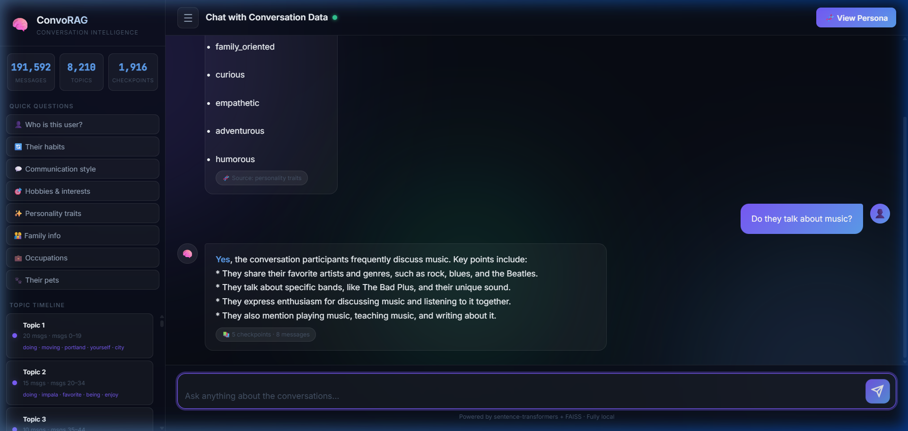
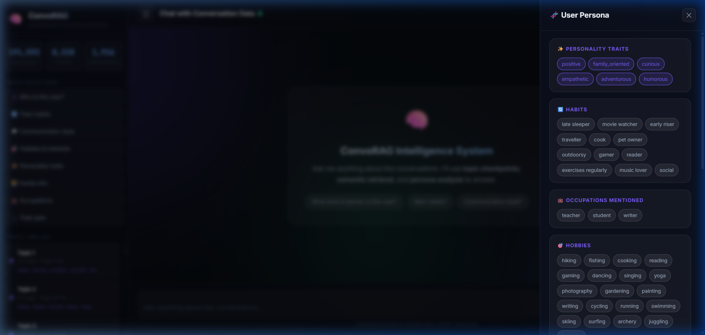
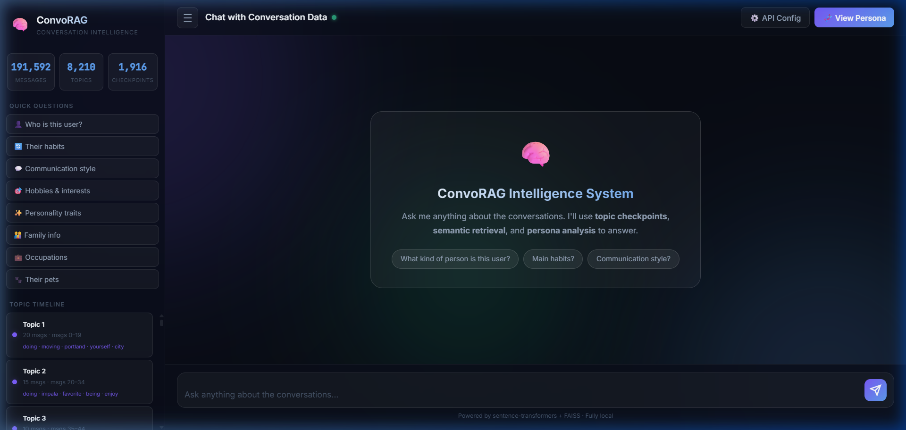

# ConvoRAG – Conversation Intelligence System

A fully local RAG (Retrieval-Augmented Generation) system that analyses a large conversation dataset, detects topic changes chronologically, extracts a user persona, and powers an interactive chatbot backed by **Groq LLM** (llama-3.1-8b-instant) + **FAISS** semantic search.

---

## 📁 Project Structure

```
kastack/
├── conversations.csv       # Input dataset (one conversation per row)
├── requirements.txt
├── .env                    # Environment configuration (GROQ_API_KEY, PORT)
├── Procfile                # Heroku/Railway deployment file
├── vercel.json             # Vercel routing configuration
│
├── data_processor.py       # Parse CSV → flat message stream (191,592 messages)
├── topic_detector.py       # Chronological topic boundary detection (embeddings + sliding window)
├── checkpoint_manager.py   # Extract TF-IDF summaries & keywords for topic & 100-msg blocks
├── persona_extractor.py    # Rule-based/Regex persona extraction (habits, personality, etc.)
├── rag_engine.py           # FAISS retrieval (Checkpoint + Msg) & Groq LLM Generation
├── build_index.py          # One-time build script for embeddings, indexes, and persona
├── app.py                  # FastAPI server hosting REST API & Web UI
│
├── docs/                   # Documentation and UI screenshots
│   ├── chat_interface.png
│   ├── persona_drawer.png
│   └── timeline_navigation.png
│
├── data/                   # Generated artifacts (cached & used by RAG engine)
│   ├── messages.json       # Deserialized raw messages
│   ├── checkpoints.json    # Summarized chronological checkpoints
│   ├── persona.json        # Extracted user persona
│   ├── embeddings.npy      # Cached SentenceTransformer embeddings
│   ├── topic_index.faiss   # Vector index for checkpoint summaries
│   └── msg_index.faiss     # Vector index for sampled individual messages
│
└── static/                 # Frontend Web Client
    ├── index.html          # HTML5 layout (glassmorphism dashboard)
    ├── style.css           # Premium styling & dark-theme variables
    └── app.js              # State management & dynamic API environment detection
```

---

## 🚀 Quick Start

### 1. Install dependencies
```bash
pip install -r requirements.txt
python -m spacy download en_core_web_sm
```

### 2. Set your Groq API key
Edit `.env`:
```
GROQ_API_KEY=gsk_xxxxxxxxxxxxxxxxxxxx
```
Get a free key at https://console.groq.com

### 3. Build the index (run once, ~3–8 min on first run)
```bash
python build_index.py
```
This will:
- Parse all conversations into a flat message stream
- Detect topic boundaries
- Generate topic + 100-msg checkpoint summaries
- Build two FAISS vector indexes
- Extract the user persona

### 4. Start the chatbot
```bash
python app.py
```
Open http://localhost:5000
API interactive docs are available at http://localhost:5000/docs

---

## 🧠 Core Systems

### 1. Chronological Topic Splitting
To split conversations into meaningful, chronological topics, we employ a localized embedding and sliding-window cosine similarity algorithm. This ensures that the natural progression of topics over time is preserved.

> [!IMPORTANT]
> **Topic Splitting Algorithm:**
> 1. **Message Embedding**: Every individual message in `conversations.csv` is embedded using `sentence-transformers/all-MiniLM-L6-v2`, producing a 384-dimensional unit normalized vector.
> 2. **Sliding Window Pooling**: We group messages chronologically using a **sliding window of 5 messages** ($W = 5$). The vectors within each window are average-pooled to create a representation of the local conversation topic:
>    $$\vec{W}_k = \frac{1}{|W|} \sum_{i \in W_k} \vec{msg}_i$$
> 3. **Cosine Similarity Check**: We compute the similarity between consecutive sliding windows:
>    $$\text{Similarity}_k = \cos(\vec{W}_{k-1}, \vec{W}_k)$$
> 4. **Boundary Detection**: When similarity drops below a tuned threshold of **0.40**, a topic split is triggered.
> 5. **Segment Merging**: To prevent overly fragmented topics (e.g., short pleasantries), a minimum segment size of **8 messages** is enforced. Topics smaller than 8 messages are automatically merged into the preceding topic.

#### Extractive Summarization & Keyword Generation
Once boundaries are set, each topic segment is analyzed:
* **Summarization**: We run a localized **TF-IDF sentence ranking algorithm** on sentences within the topic. Sentences are scored based on term frequency-inverse document frequency weights, and the top-3 scoring sentences are joined to form an extractive summary (no external LLM API required).
* **Keywords**: We extract the top-5 most frequent non-stopword tokens as keywords for visual labeling.

---

### 2. Relevant Retrieval (RAG Engine)
ConvoRAG uses a multi-layered FAISS retrieval architecture to match user queries with the most contextually relevant parts of the conversation.

> [!NOTE]
> **Multi-Layered FAISS Retrieval & Context Routing:**
> * **Index 1: Checkpoint Index (`topic_index.faiss`)**: Encodes the extractive summaries of all **8,210 topic checkpoints** and **1,916 100-message checkpoints** (10,126 vectors total). This index captures high-level context.
> * **Index 2: Message Index (`msg_index.faiss`)**: Encodes individual messages, sampled every 5th message (38,319 vectors total), to capture highly specific statements or details.
> * **API Key Fallback**: If `GROQ_API_KEY` is not present, the system falls back to a **template-based retrieval viewer** that directly shows the top-retrieved checkpoint summary and relevant snippets without failing.

#### Direct Intercept Router
To avoid semantic search confusion when a user selects a specific topic from the chronological timeline sidebar (e.g., clicking or asking about "Topic 2"), `rag_engine.py` implements a **Direct Intercept Router**:
* It parses the query for patterns like `\btopic\s+(\d+)\b`.
* If matched, it bypasses FAISS vector search entirely and loads the exact topic segment from `checkpoints.json`.
* It fetches the corresponding raw messages for that segment from `msg_index_meta.json`.
* This ensures **100% accurate, zero-leak retrieval** of the selected chronological topic.

---

### 3. Meaningful Persona Extraction
A structured persona is generated locally in `data_processor.py` / `persona_extractor.py` using regex libraries, NLP heuristics (via `spaCy`), and keyword frequency statistics.

* **Personality Traits**: Inferred based on keyword frequency scoring across 8 categories (e.g., positive, empathetic, curious, adventurous, family-oriented).
* **Habits**: Extracted using regex match libraries for patterns (e.g., *early riser*, *late sleeper*, *cook*, *gamer*, *pet owner*, *exercises regularly*).
* **Personal Facts**: Identifies mentioned occupations, relationships/family indicators, locations, and pets.
* **Communication Style**: Automatically computes statistical metrics:
  * **Average message length** (11.3 words)
  * **Tone** (casual/formal markers)
  * **Punctuation rates** (22.9% questions, 53% exclamations)
  * **Emoji density** (rare/occasional/frequent)

#### Persona Shortcut Router (Bypass LLM)
To reduce latency and LLM token usage, the RAG engine intercepts queries about the user's persona (e.g., *"What are their habits?"*, *"Who is this user?"*, *"How do they communicate?"*). If a direct query is detected and does not contain conversation retrieval signals, the engine reads directly from `data/persona.json` and responds **instantly (< 1ms)** without calling the Groq API.

---

## 🖥️ User Interface & Visual Walkthrough

### 📽️ Video Demo
* **Walkthrough Video**: [Watch the ConvoRAG Demo on Loom](https://www.loom.com/share/your-video-id-here) (Placeholder)

### 📸 Interface Screenshots

#### 1. Main Chat Interface
Featuring a dark glassmorphism dashboard, real-time message/topic/checkpoint statistics counters, and interactive quick questions.


#### 2. Chronological Timeline Sidebar
Allows users to browse all 8,210 topics chronologically, inspect their keywords, and click any topic to query it directly.


#### 3. Structured Persona Panel
Slide-out side panel displaying the extracted traits, habits, communication metrics, and personal facts instantly.


---

## 📦 Key Dependencies

| Library | Purpose |
|---|---|
| `sentence-transformers` | Local message/query embeddings |
| `faiss-cpu` | Fast vector similarity search |
| `groq` | LLM answer generation (llama-3.1-8b-instant) |
| `fastapi` | Web API + UI server |
| `uvicorn` | ASGI server |
| `spacy` | NLP for persona extraction |
| `python-dotenv` | Env variable management |

---

## ⚡ Performance Notes

- Embeddings are **cached** in `data/embeddings.npy` — only computed once
- Message index samples **every 5th message** for speed (still covers full dataset)
- Groq inference is extremely fast (~0.5–2s response time)
- Persona questions bypass LLM entirely for **instant** responses

---

## 📝 Example Queries

```
"What kind of person is this user?"
"What are their habits?"
"How do they communicate?"
"What hobbies come up most often?"
"Do they talk about music?"
"Tell me about their family"
"What jobs are mentioned in the conversations?"
```
